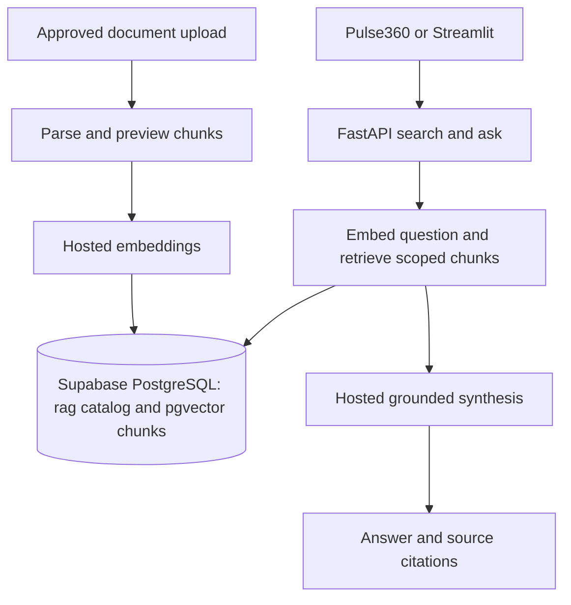

# Supabas_pulse360_RAG

Independent starting point for a Supabase-backed RAG and vector-search template.
Pulse360 FAQ assistance is the first target; guesthouse/property search is a future
use case. This folder is separate from OpenSource-RAG-Template.

## Current status

The Streamlit workspace, FastAPI document routes, and standalone
`supabase_pgvector_test.py` now use the direct Supabase/pgvector path. The
legacy Qdrant/SQLite adapters remain in the repository for older CLI/tests and
can be removed after the Supabase route migration has been validated.

This copy includes FastAPI, the Streamlit test UI, document parsing/chunking,
hosted HF embeddings and synthesis, storage adapters, tests and uv.lock. Secrets,
private FAQs, catalogs, vectors, cloud migration scripts and Git history are excluded.
The Python package name remains `faq_agent` and the dependency project name remains
`faq-document-rag` to retain the baseline lock; use a separate virtual environment.

## Target architecture



This diagram describes the target, not the current implementation. Keep platform
tables separate from a restricted `rag` schema. Do not grant the assistant arbitrary
SQL access to platform data. Raw files, if retained, belong in private object storage.

## Start the next chat

Read [HANDOFF.md](HANDOFF.md), then inspect `src/faq_agent/ingestion/service.py`,
`vectordb/vector_store.py`, `config.py`, `api/documents.py` and their tests.
Do not modify OpenSource-RAG-Template or its running services from this project.

## Reproduce the inherited baseline

```powershell
uv sync --locked --extra dev --extra ui
.\.venv\Scripts\python.exe -m pytest -q
```

No `.env` is included in the repository. Create the private file at
`C:\Users\Jabulani Ndlovu\Downloads\Project Folder\Project Folder\Idea_Not_Started\Supabas_pulse360_RAG\.env`
and set `SUPABASE_DATABASE_URL` there for the direct smoke test. Do not commit
that file. Baseline runtime instructions are
in [docs/baseline-local-setup.md](docs/baseline-local-setup.md); do not reuse occupied
ports or connect this copy to the original project's mutable data.

## Guides

- [Handoff and implementation gates](HANDOFF.md)
- [Inherited architecture](docs/architecture.md): describes the copied baseline only.
- [Inherited test guide](docs/testing.md)
- [Inherited upload guide](docs/ui-testing.md)
- [Copy provenance](docs/copy-manifest.json): source revision and hashes of copied files.

This is a code template, not a created Supabase cloud project or a deployed service.

## Direct Supabase pgvector smoke test

The standalone `supabase_pgvector_test.py` Streamlit page is now wired directly
to the existing Supabase PostgreSQL database through `SUPABASE_DATABASE_URL`.
It does not use Qdrant, SQLite, or the baseline FastAPI upload endpoint. Use it
to validate the `rag` schema, 384-dimensional embedding writes, and
`rag.match_document_chunks` retrieval before migrating the full API.

```powershell
uv sync --extra ui
uv run streamlit run supabase_pgvector_test.py --server.address 127.0.0.1 --server.port 8503
```

Set the private connection string in `.env`, keep the reusable collection as
`test_collection`, upload a small document, and then run the cleanup command:

```powershell
uv run python scripts/delete_supabase_test_document.py
```

Cleanup removes only documents marked with the reserved
`__pgvector_test__/` filename prefix, their chunks and embeddings. It never
drops or deletes `test_collection`. Full instructions are in
[`docs/supabase-pgvector-smoke-test.md`](docs/supabase-pgvector-smoke-test.md).

## Schema gotchas to check before embedding

`insert_document` only writes columns that exist in your live `rag` tables and that it has
a value for. If your schema names a NOT NULL column differently, the column is skipped
silently and Postgres rejects the row. Check these before your first embed:

- **Collection must exist.** `Collection 'test_collection' does not exist` means there is
  no matching row in `rag.collections`. Insert one (`id`, `display_name`, `visibility`);
  the `id` is case-sensitive and must match `SUPABASE_TEST_COLLECTION`.
- **`rag.documents.sha256`** must be populated. The code sets `sha256`, `checksum` and
  `content_hash` to the same text digest; any of the three that your table lacks is dropped.
- **`rag.document_chunks.ordinal`** must be populated. The code sets both `ordinal` and
  `chunk_index` to the chunk position; the one your table lacks is dropped.

To list every required column the code must fill, run this in the Supabase SQL editor and
confirm each one has a matching key in `document_values` or `chunk_values`:

```sql
select table_name, column_name
from information_schema.columns
where table_schema = 'rag'
  and table_name in ('documents', 'document_chunks')
  and is_nullable = 'NO'
  and column_default is null
order by table_name, ordinal_position;
```

If you rename columns or add new required ones, add the matching keys in
`supabase_pgvector_test.py` and record the change in [BUG_AUDIT.md](BUG_AUDIT.md).