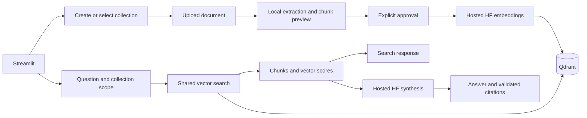

# FAQ RAG Workspace

A local document workspace: create a collection, upload a document, review chunks,
approve hosted embeddings, then search or ask questions with source citations.
FastAPI serves the backend, Streamlit is the test UI, Qdrant stores vectors, and
Hugging Face hosts embedding and answer models.
SQLite tracks document ingestion.

## Project structure

```text
OpenSource-RAG-Template/
  README.md
  pyproject.toml              # Dependencies and tool settings
  uv.lock                    # Reproducible dependency resolution
  .env.example               # Configuration reference, without secrets
  .env                       # Private local configuration; ignored by Git
  main.py                    # FastAPI entry point
  streamlit_app.py            # UI entry point
  docker-compose.yml         # Local Qdrant; optional Chroma profile
  Dockerfile                 # API container definition
  src/faq_agent/
    config.py                # Validated settings and project paths
    schemas.py               # Document, chunk and retrieval data types
    ingestion/
      loader.py              # Read documents for CLI ingestion
      service.py             # Reviewed upload, catalog and storage lifecycle
    chunking/chunker.py       # Section-aware character windows
    embeddings/embedder.py   # Hosted embedding client and vector validation
    vectordb/vector_store.py # Qdrant and optional Chroma adapters
    retrieval/retriever.py   # Shared search and answer workflow
    prompts/templates.py     # Grounding instructions and abstention text
    llm/client.py            # Hosted synthesis and citation validation
    api/
      routes.py              # Health, search and ask
      documents.py           # Collection and upload endpoints
  scripts/                   # Environment setup, CLI ingestion, evaluation
  tests/                     # Offline unit, integration and UI tests
  examples/                  # Synthetic demo and FAQ source files
  docs/
    architecture.md          # Responsibilities, data flow, limitations
    ui-testing.md            # Upload workflow and API reference
    testing.md               # Automated and live verification
  BUG_AUDIT.md               # Concise current verification/recovery record
  .local/                    # Ignored SQLite catalog, logs and local backups
```

Each Python package contains an `__init__.py`. 
Dependencies live in pyproject.toml and uv.lock; no duplicate requirements.txt is maintained.
Settings live in config.py and .env; no second YAML configuration layer is needed.
```
Only add utility modules when there is shared logic to put in them😉.
```

## Run locally

Requires Python 3.11-3.13, uv and Docker for Qdrant.

```powershell
uv sync --locked --extra dev --extra ui
.\.venv\Scripts\python.exe scripts/setup_env.py --sync
.\.venv\Scripts\python.exe scripts/setup_env.py --token
docker compose up -d qdrant
```

The setup script backs up an existing .env before merging current keys; it preserves
configured values and never prints credentials. 
Set EMBEDDING_URL, HF_TOKEN and LLM_MODEL privately. 
VECTOR_URL must match QDRANT_PORT (this machine uses 6334; the template defaults to 6333).
Existing configured values need not be reset.

Start each server in a separate terminal from this folder:

```powershell
.\.venv\Scripts\python.exe -m uvicorn main:app --host 127.0.0.1 --port 8767
```

```powershell
.\.venv\Scripts\python.exe -m streamlit run streamlit_app.py --server.address 127.0.0.1 --server.port 8502 --server.maxUploadSize 10 --browser.gatherUsageStats false
```

Open [Streamlit](http://127.0.0.1:8502) or [Swagger](http://127.0.0.1:8767/docs).
The previous `faq_agent.api:app` entry point still works.
Restart the API after changing settings. `FAQ_API_URL` overrides the UI's API address.

## Workflow



Preview is local and makes no model calls. Embed and store sends approved text to
the configured embedding endpoint. Search embeds the question; Ask uses the same
retrieval function and then generates an answer. Reranking is not currently used;
the compatibility response field `rerank_score` is null.

The existing synthetic `ui_smoke_test` collection can answer "What does Project
Atlas show?". For your FAQ, select or create `pulse360_faq`, upload the document,
review chunks, approve, then store. The original `embedding_demo-bd228c87eb28`
collection remains accessible through requests without collection_id.

## Verification and boundaries

Verified locally on 2026-09-15: all 55 tests and lint passed. After restart,
collection-scoped search/answer and the original demo search passed live checks;
existing collection identities and document counts were unchanged.

- [Tests and evaluation](docs/testing.md)
- [Architecture and configuration](docs/architecture.md)
- [UI workflow and endpoint reference](docs/ui-testing.md)

This is a single-user local MVP. Keep servers on loopback. No authentication,
background ingestion, OCR or production deployment is implemented. Preserve
both the Qdrant volume and `.local/library.sqlite3`. Hosted model usage may consume
credits; the application does not enforce provider billing caps.
