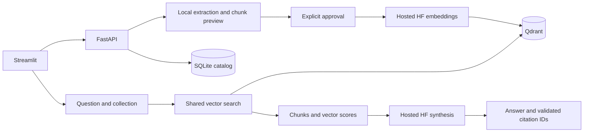

# Local FAQ workspace

The Streamlit UI calls FastAPI; only the backend holds HF and Qdrant credentials.
This version is a single-user local test workspace, not a public deployment.

## Run

From the repository root, install with `uv sync --extra dev --extra ui`.
Run each server in a separate terminal:

```powershell
.\.venv\Scripts\python.exe -m uvicorn faq_agent.api:app --app-dir src --host 127.0.0.1 --port 8767
.\.venv\Scripts\python.exe -m streamlit run streamlit_app.py --server.address 127.0.0.1 --server.port 8502 --browser.gatherUsageStats false
```

Open http://127.0.0.1:8502. `FAQ_API_URL` overrides the UI's API address (default
http://127.0.0.1:8767). If a port is already occupied, use an available one.

## Workflow

1. Create `pulse360_faq`, or select a collection created through this application.
2. Upload `examples/faq/Pulse360_Platform_FAQ.pdf` and select Preview chunks.
3. Review the text, page number and chunk count. Preview makes no HF calls.
4. Approve hosted processing, then select Embed and store. This sends the chunks
   to the configured HF embedding endpoint and writes vectors/text to Qdrant.
5. Open Questions. Choose Search for chunks and vector scores, or Answer for
   retrieval followed by hosted LLM synthesis with citations. Optionally select
   a single document. Each question is independent; displayed history is not sent
   as conversational memory.

The UI lists application-managed collections, not arbitrary existing Qdrant
collections. The original embedding_demo collection is unchanged and remains
accessible through /search and /ask when collection_id is omitted.

## API

| Method | Route | Purpose |
| --- | --- | --- |
| GET | /collections | List application-managed collections |
| POST | /collections | Create with `{"name":"pulse360_faq"}` |
| GET | /collections/{id}/documents | List committed documents |
| POST | /collections/{id}/uploads/preview | Multipart `file`; extract and chunk locally |
| POST | /collections/{id}/documents | `preview_id` and `approved:true`; embed/store |
| POST | /search | question, optional collection_id and document_id |
| POST | /ask | Same retrieval scope, then HF synthesis |

## Boundaries

- Qdrant stores vectors and chunk text. `.local/library.sqlite3` stores the
  collection registry, committed document records and temporary preview text.
  Back up both SQLite and Qdrant; the registry is required to access UI documents.
- Preview IDs expire after one hour. Expired preview rows are removed on the next
  preview request, not by a background cleanup service.
- PDF/TXT/MD only: 10 MB, 100 PDF pages, 100,000 extracted characters and at most
  100 chunks. Scanned PDFs require OCR elsewhere. PDF extraction is page-by-page.
- Chunking uses configured CHUNK_CHARS and CHUNK_OVERLAP (defaults 1000/150),
  section headings and whitespace boundaries. It does not guarantee whole FAQ
  question/answer pairs, especially across PDF pages. Preview before committing.
- The preview shows text and planned vector dimensions, not computed embeddings.
- Identical file content is deduplicated per collection, even when renamed.
  Failed/interrupted commits can be retried; only committed documents are searched.
- Collections record their embedding configuration. A changed model/configuration
  requires a new collection; models with equal dimensions are not interchangeable.
- Reranking remains deferred. Vector scores are similarity, not accuracy/confidence.
- Hosted calls may consume credits; preview does not. The app does not impose a
  provider billing cap. Keep the account restricted to included credits.
- No authentication, OCR, deletion, multi-user access control or background jobs
  yet. Keep both servers on loopback. SQLite and synchronous ingestion are local
  MVP choices, not suitable as-is for ephemeral Vercel instances.


